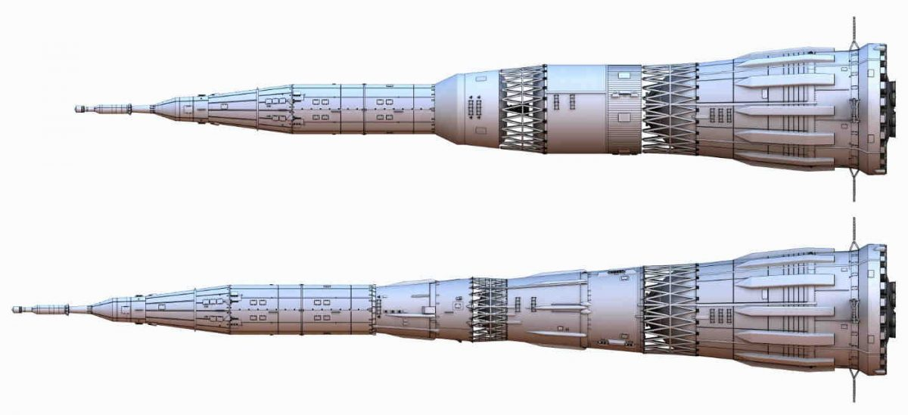
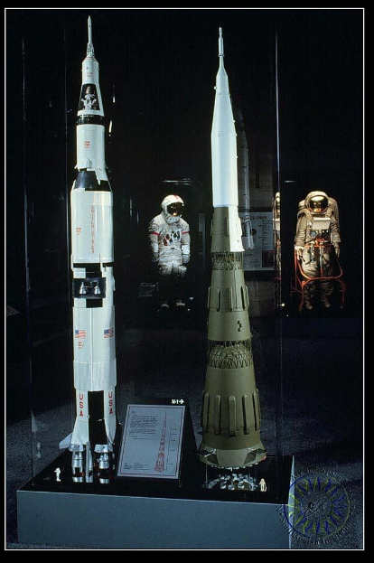

## O que foi o foguete lunar N-1?

**ChatGPT:**
O foguete lunar N-1 foi um veículo de lançamento de grande porte desenvolvido pela União Soviética durante a corrida espacial na década de 1960. Foi projetado para ser o principal veículo de lançamento para a missão lunar soviética, que visava colocar um cosmonauta na Lua antes dos americanos.

O N-1 tinha um design bastante ambicioso, com uma altura de cerca de 105 metros e uma capacidade de carga útil significativa. No entanto, o desenvolvimento do N-1 foi marcado por uma série de problemas técnicos e falhas, o que resultou em quatro lançamentos de teste, todos terminando em fracasso. Os principais problemas incluíram problemas com os motores do primeiro estágio, que foram responsáveis por várias explosões catastróficas durante os testes.

Devido aos problemas persistentes e ao sucesso do programa lunar americano, o programa N-1 foi eventualmente cancelado em 1974, antes que pudesse realizar uma missão lunar bem-sucedida. Embora tenha sido um fracasso em termos de alcançar seu objetivo principal, o desenvolvimento do N-1 proporcionou importantes aprendizados para a exploração espacial russa e contribuiu para o desenvolvimento de futuros programas espaciais.

## Por favor descreva de forma resumida como foram os quatro lançamentos de testes

**ChatGPT:**
Claro, aqui está um resumo dos quatro lançamentos de teste do foguete lunar N-1:

Lançamento N-1 3L: Em fevereiro de 1969, o primeiro lançamento de teste terminou apenas 68 segundos após a decolagem devido a uma falha em um dos motores do primeiro estágio. Isso resultou em uma explosão catastrófica, destruindo o foguete e a plataforma de lançamento.
Lançamento N-1 5L: Em julho de 1969, o segundo lançamento também falhou pouco após a decolagem, com um problema semelhante ocorrendo no primeiro estágio. O foguete explodiu, causando danos significativos à plataforma de lançamento.
Lançamento N-1 6L: Em junho de 1971, o terceiro lançamento de teste parecia estar indo bem inicialmente, mas uma anomalia ocorreu no motor do segundo estágio, levando à perda de controle e à queda do foguete. Novamente, resultou em uma explosão.
Lançamento N-1 7L: Em novembro de 1972, o quarto e último lançamento de teste também terminou em fracasso, quando um dos motores do primeiro estágio falhou após a decolagem. O foguete caiu e explodiu, encerrando o programa N-1.

## Quais eram os responsáveis por sua construção e onde ele era fabricado?
**ChatGPT:**
O foguete lunar N-1 foi desenvolvido pela OKB-1, uma organização de design de engenharia liderada pelo engenheiro-chefe Sergei Korolev. Korolev foi uma figura proeminente no programa espacial soviético e desempenhou um papel fundamental no desenvolvimento de foguetes e na conquista do espaço pela União Soviética.

Quanto à fabricação, o N-1 foi principalmente construído no Centro de Pesquisa e Produção Espacial TsSKB-Progress (atualmente conhecido como S.P. Korolev Rocket and Space Corporation Energia) em Samara, Rússia. Este centro desempenhou um papel central na produção de foguetes e espaçonaves para o programa espacial soviético.

## Quantos estágios tinha este foguete? Por favor faça um breve resumo
**ChatGPT:**
O foguete lunar N-1 tinha cinco estágios em sua configuração original:

Primeiro Estágio (N-1 Block A): Este era o estágio principal, responsável pela maior parte da propulsão inicial. Ele possuía 30 motores NK-15.
Segundo Estágio (N-1 Block B): Após o esgotamento do primeiro estágio, este estágio assumia o controle da missão. Ele era equipado com 8 motores NK-15V.
Terceiro Estágio (N-1 Block V): Este estágio continuava a impulsionar a carga útil em direção à órbita terrestre. Ele era movido por 4 motores NK-21.
Quarto Estágio (Bloco G): O quarto estágio era usado para inserir a carga útil em uma trajetória translunar. Era equipado com um único motor RD-58.
Quinto Estágio (Bloco D): Este estágio era responsável por realizar a inserção lunar e colocar a carga útil na órbita lunar. Ele continha um motor RD-58M.
Essa configuração de cinco estágios foi projetada para fornecer energia suficiente para colocar uma carga útil pesada na órbita lunar, como a espaçonave Soyuz ou uma nave lunar, além de suprimentos e equipamentos necessários para uma missão tripulada à Lua. No entanto, devido a problemas técnicos e falhas nos testes, o N-1 nunca conseguiu alcançar seu objetivo de enviar cosmonautas à Lua.

## Me fale de forma resumida sobre a espaçonave Soyuz que seria enviada para a Lua
**ChatGPT:**
A espaçonave Soyuz modificada para missões lunares, conhecida como L3, foi desenvolvida como parte do programa lunar soviético para competir com o programa Apollo dos Estados Unidos. A Soyuz L3 era projetada para transportar cosmonautas à Lua e possivelmente realizar uma aterrissagem lunar.

A Soyuz L3 consistia em três partes principais: o módulo de comando e serviço, o módulo de descida e o módulo de subida lunar. O módulo de comando e serviço abrigava os sistemas de suporte à vida e controle da missão. O módulo de descida, semelhante ao usado nas missões Soyuz da época, conteria os cosmonautas durante a descida à superfície lunar. O módulo de subida lunar seria usado para retornar os cosmonautas à órbita lunar após a conclusão da exploração lunar.

No entanto, devido aos problemas enfrentados com o foguete lunar N-1 e a falta de sucesso nos testes, a Soyuz L3 nunca foi lançada em uma missão lunar. Como resultado, a União Soviética nunca conseguiu enviar cosmonautas à Lua. Após o cancelamento do programa lunar soviético, a Soyuz continuou a ser usada em missões espaciais tripuladas para órbita terrestre baixa e estação espacial.

## Você sabe me informar se cosmonautas foram treinados para estas missões?
**ChatGPT:**
Sim, cosmonautas foram treinados para as potenciais missões lunares do programa soviético. Os cosmonautas treinados para essas missões faziam parte de um grupo conhecido como "Grupo Lunar" ou "Grupo Lunny". Este grupo incluía cosmonautas como Yuri Gagarin, o primeiro ser humano a viajar para o espaço, assim como outros cosmonautas soviéticos proeminentes.

Esses cosmonautas passaram por treinamento intensivo, incluindo simulações de voo, treinamento de sobrevivência, treinamento de operações de superfície lunar e muito mais. No entanto, devido aos problemas técnicos enfrentados com o foguete N-1 e o cancelamento do programa lunar soviético, nenhum desses cosmonautas teve a oportunidade de voar para a Lua.

Após o cancelamento do programa lunar, muitos desses cosmonautas continuaram suas carreiras espaciais em missões para a órbita terrestre baixa, estações espaciais e outras missões espaciais tripuladas.

## Qual era o concorrente do foguete N-1 na corrida para a Lua, e qual era a diferença de carga útil entre eles?

**ChatGPT:**
O principal concorrente do foguete N-1 na corrida para a Lua era o foguete Saturn V, desenvolvido pela NASA como parte do programa Apollo dos Estados Unidos. O Saturn V foi o veículo de lançamento usado para enviar astronautas americanos à Lua durante as missões Apollo.

Em termos de carga útil, o Saturn V tinha uma capacidade significativamente maior do que o N-1. O Saturn V podia lançar aproximadamente 118 toneladas para a órbita terrestre baixa, enquanto o N-1 tinha uma capacidade de carga útil estimada de cerca de 95 toneladas para a mesma órbita. Isso significa que o Saturn V tinha uma vantagem considerável em termos de capacidade de carga, o que era crucial para transportar as espaçonaves e equipamentos necessários para uma missão lunar tripulada.

