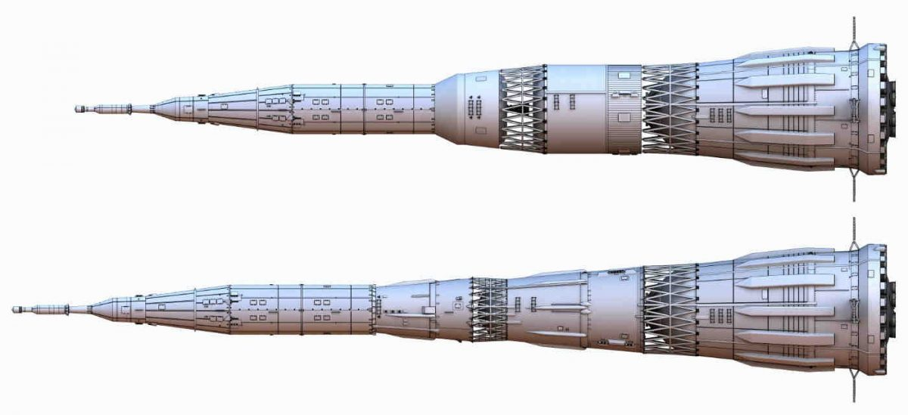
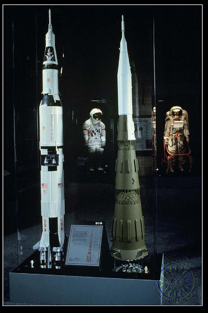

## What was the N-1 moon rocket?

**ChatGPT:**
The N-1 moon rocket was a large launch vehicle developed by the Soviet Union during the space race in the 1960s. It was designed to be the main launch vehicle for the Soviet lunar mission, which aimed to put a cosmonaut on the Moon before the Americans.

The N-1 had a rather ambitious design, with a height of around 105 meters and a significant payload capacity. However, the development of the N-1 was marked by a series of technical problems and failures, which resulted in four test launches, all of which ended in failure. The main problems included issues with the first stage engines, which were responsible for several catastrophic explosions during the tests.

Due to the persistent problems and the success of the American lunar program, the N-1 program was eventually cancelled in 1974, before it could carry out a successful lunar mission. Although it was a failure in terms of achieving its main objective, the development of the N-1 provided important lessons for Russian space exploration and contributed to the development of future space programs.

## Please describe briefly how the four test launches went
**ChatGPT:**
Of course, here's a summary of the four test launches of the N-1 moon rocket:

Launch N-1 3L: In February 1969, the first test launch ended just 68 seconds after liftoff due to a failure in one of the first-stage engines. This resulted in a catastrophic explosion, destroying the rocket and the launch pad.
N-1 5L launch: In July 1969, the second launch also failed shortly after take-off, with a similar problem occurring in the first stage. The rocket exploded, causing significant damage to the launch pad.
N-1 6L launch: In June 1971, the third test launch seemed to be going well initially, but an anomaly occurred in the second stage engine, leading to a loss of control and the rocket crashing. Again, an explosion resulted.
N-1 7L launch: In November 1972, the fourth and final test launch also ended in failure, when one of the first stage engines failed after take-off. The rocket crashed and exploded, ending the N-1 program.

## Who was responsible for its construction and where was it manufactured?
**ChatGPT:**
The N-1 moon rocket was developed by OKB-1, an engineering design organization led by chief engineer Sergei Korolev. Korolev was a leading figure in the Soviet space program and played a key role in the development of rockets and the Soviet Union's conquest of space.

As for manufacturing, the N-1 was mainly built at the TsSKB-Progress Space Research and Production Center (now known as S.P. Korolev Rocket and Space Corporation Energia) in Samara, Russia. This center played a central role in the production of rockets and spacecraft for the Soviet space program.

## How many stages did this rocket have? Please give a brief summary
**ChatGPT:**
The N-1 moon rocket had five stages in its original configuration:

First Stage (N-1 Block A): This was the main stage, responsible for most of the initial propulsion. It had 30 NK-15 engines.
Second Stage (N-1 Block B): After the first stage was exhausted, this stage took over control of the mission. It was equipped with 8 NK-15V engines.
Third Stage (N-1 Block V): This stage continued to propel the payload towards Earth orbit. It was powered by 4 NK-21 engines.
Fourth Stage (Block G): The fourth stage was used to insert the payload into a translunar trajectory. It was equipped with a single RD-58 engine.
Fifth Stage (Block D): This stage was responsible for performing the lunar insertion and placing the payload into lunar orbit. It contained an RD-58M engine.
This five-stage configuration was designed to provide enough power to place a heavy payload into lunar orbit, such as the Soyuz spacecraft or a lunar spacecraft, as well as supplies and equipment needed for a manned mission to the Moon. However, due to technical problems and test failures, the N-1 never managed to achieve its goal of sending cosmonauts to the Moon.

## Tell me briefly about the Soyuz spacecraft that would be sent to the Moon
**ChatGPT:**
The Soyuz spacecraft modified for lunar missions, known as the L3, was developed as part of the Soviet lunar program to compete with the United States' Apollo program. The Soyuz L3 was designed to transport cosmonauts to the Moon and possibly carry out a lunar landing.

The Soyuz L3 consisted of three main parts: the command and service module, the descent module and the lunar ascent module. The command and service module housed the mission's life support and control systems. The descent module, similar to the one used in the Soyuz missions of the time, would contain the cosmonauts during the descent to the lunar surface. The lunar ascent module would be used to return the cosmonauts to lunar orbit after completing lunar exploration.

However, due to problems with the N-1 lunar rocket and a lack of success in testing, the Soyuz L3 was never launched on a lunar mission. As a result, the Soviet Union never managed to send cosmonauts to the Moon. After the cancellation of the Soviet lunar program, the Soyuz continued to be used in manned space missions to low-Earth orbit and the space station.

## Can you tell me if cosmonauts have been trained for these missions?
**ChatGPT:**
Yes, cosmonauts were trained for the potential lunar missions of the Soviet program. The cosmonauts trained for these missions were part of a group known as the "Lunar Group" or "Lunny Group". This group included cosmonauts such as Yuri Gagarin, the first human being to travel into space, as well as other prominent Soviet cosmonauts.

These cosmonauts underwent intensive training, including flight simulations, survival training, lunar surface operations training and much more. However, due to the technical problems faced with the N-1 rocket and the cancellation of the Soviet lunar program, none of these cosmonauts had the opportunity to fly to the Moon.

After the cancellation of the lunar program, many of these cosmonauts continued their space careers on missions to low-Earth orbit, space stations and other manned space missions.

## What was the N-1 rocket's competitor in the race to the Moon, and what was the difference in payload between them?
**ChatGPT:**
The N-1 rocket's main competitor in the race to the Moon was the Saturn V rocket, developed by NASA as part of the US Apollo program. The Saturn V was the launch vehicle used to send American astronauts to the Moon during the Apollo missions.

In terms of payload, the Saturn V had a significantly higher capacity than the N-1. The Saturn V could launch approximately 118 tons into low Earth orbit, while the N-1 had an estimated payload capacity of around 95 tons for the same orbit. This meant that the Saturn V had a considerable advantage in terms of payload capacity, which was crucial for transporting the spacecraft and equipment needed for a manned lunar mission.

